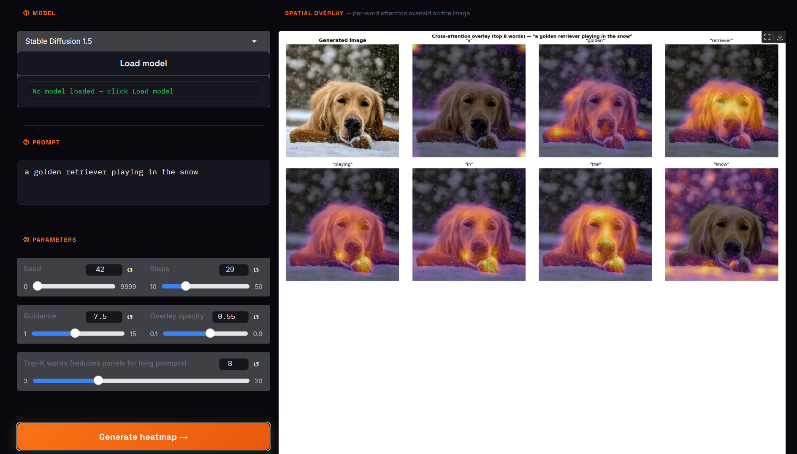
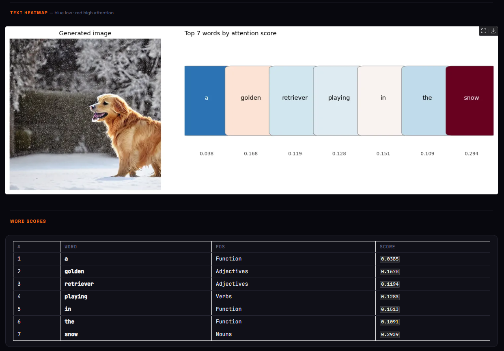

<div align="center">

<br/>

```
██████╗ ██████╗  ██████╗ ███╗   ███╗██████╗ ████████╗██╗     ███████╗███╗   ██╗███████╗
██╔══██╗██╔══██╗██╔═══██╗████╗ ████║██╔══██╗╚══██╔══╝██║     ██╔════╝████╗  ██║██╔════╝
██████╔╝██████╔╝██║   ██║██╔████╔██║██████╔╝   ██║   ██║     █████╗  ██╔██╗ ██║███████╗
██╔═══╝ ██╔══██╗██║   ██║██║╚██╔╝██║██╔═══╝    ██║   ██║     ██╔══╝  ██║╚██╗██║╚════██║
██║     ██║  ██║╚██████╔╝██║ ╚═╝ ██║██║        ██║   ███████╗███████╗██║ ╚████║███████║
╚═╝     ╚═╝  ╚═╝ ╚═════╝ ╚═╝     ╚═╝╚═╝        ╚═╝   ╚══════╝╚══════╝╚═╝  ╚═══╝╚══════╝
```

### *See exactly which words shape which pixels.*

<br/>

[](https://www.python.org/)
[](https://pytorch.org/)
[](https://huggingface.co/docs/diffusers)
[](https://gradio.app/)
[](LICENSE)

<br/>

> PromptLens hooks into the **cross-attention layers** of Stable Diffusion and maps every word in your prompt to the exact pixels it influenced — extracted live during inference, no extra passes needed.

<br/>

</div>

---

## 📸 Demo

<!-- Replace the blocks below with real screenshots once you've run the app -->

| Spatial Overlay | Text Heatmap |
|:---:|:---:|
|  |  |
| *Per-word attention overlaid on the generated image* | *Top-K words ranked by influence, blue → red* |

<br/>

---

## ✨ What Does It Do?

When you write `"a golden retriever playing in the snow"`, PromptLens answers:

- Which pixels did **"retriever"** activate?
- Did **"golden"** influence the fur color or something else?
- How much weight did the model give **"snow"** vs **"playing"**?

It does this by registering a custom processor on every cross-attention (`attn2`) block in the UNet, collecting the raw attention weight tensors across the final N denoising steps, averaging them, and projecting them back to image space — one 64×64 heatmap per token.

---

## 🗂 Project Structure

```
PromptLens/
│
├── app.py                  # Gradio web UI
├── heatmap_generator.py    # Core library — use this standalone too
│
├── requirements.txt        # Python dependencies
├── LICENSE                 # MIT
├── .gitignore
│
└── assets/                 # Screenshots for this README
    ├── demo_overlay.png
    └── demo_textheatmap.png
```

---

## ⚡ Quickstart

### 1 — Clone

```bash
git clone https://github.com/KnoxCodes/PromptLens.git
cd PromptLens
```

### 2 — Install

```bash
pip install -r requirements.txt
```

> **GPU strongly recommended.** A CUDA GPU with ≥ 6 GB VRAM gives you ~20 s per image.
> CPU works but is very slow (~5–10 min).

### 3 — Run the UI

```bash
python app.py
```

Open the local Gradio URL printed in the terminal. Use `--share` or set `share=True` in `app.py` to get a public link (useful for Colab / Kaggle).

---

## 🐍 Python API

You can also use `HeatmapGenerator` as a standalone library, no UI needed:

```python
from heatmap_generator import HeatmapGenerator

# Load once
gen = HeatmapGenerator(model_id="runwayml/stable-diffusion-v1-5")

# Run on any prompt
result = gen.run("a futuristic city at dusk", seed=42)

# Visualise
result.show()                  # opens overlay + text heatmap
result.show(top_k=5)           # only the 5 most influential words

# Save to disk
result.save("outputs/")        # saves overlay.png + text_heatmap.png

# Switch models — old model is unloaded from VRAM first
gen.switch_model("stabilityai/stable-diffusion-2-1")
result2 = gen.run("a red sports car on a highway at night", seed=7)
```

### `HeatmapResult` reference

| Attribute / Method | Type | Description |
|---|---|---|
| `.image` | `PIL.Image` | The generated image |
| `.words` | `list[str]` | Clean word strings (special tokens stripped) |
| `.scores` | `list[float]` | Per-word mean attention score |
| `.top_pairs(k)` | `list[tuple]` | `(index, word, score)` — top-k, sorted by prompt position |
| `.overlay_pil(alpha, top_k)` | `PIL.Image` | Spatial heatmap grid as PIL image |
| `.text_heatmap_pil(top_k)` | `PIL.Image` | Color-coded token bar as PIL image |
| `.save(folder, top_k)` | `str, str` | Saves both figures, returns paths |

---

## 🤖 Supported Models

| Name | HuggingFace ID | Best For |
|---|---|---|
| Stable Diffusion 1.5 | `runwayml/stable-diffusion-v1-5` | Fast baseline, ~4 GB VRAM |
| Stable Diffusion 2.1 | `stabilityai/stable-diffusion-2-1` | Better overall quality |
| DreamShaper | `Lykon/DreamShaper` | Artistic / illustrated style |
| Realistic Vision | `SG161222/Realistic_Vision_V1.4` | Photorealistic output |
| OpenJourney | `prompthero/openjourney` | MidJourney-like aesthetic |

Any SD 1.x / 2.x model that uses the standard `StableDiffusionPipeline` should work — just pass the HuggingFace repo ID to `HeatmapGenerator(model_id=...)`.

---

## 🔬 How It Works

```
                         ┌─────────────────────────────────┐
  "a cat in the snow"    │         CLIP Tokenizer          │
         │               └────────────────┬────────────────┘
         │                                │  token ids
         │               ┌────────────────▼────────────────┐
         │               │        CLIP Text Encoder        │
         │               └────────────────┬────────────────┘
         │                                │  text embeddings
         │               ┌────────────────▼────────────────┐
         │               │    UNet (denoising, T steps)    │
         │               │                                 │
         │               │  ┌──────────────────────────┐   │
         │               │  │  attn2 (cross-attention) │◄──┘
         │               │  │  — captured last N steps │
         │               │  └──────────────┬───────────┘
         │               └─────────────────┼───────────────┘
         │                                 │  [B, heads, spatial, tokens]
         │               ┌─────────────────▼───────────────┐
         │               │  Average heads + steps          │
         │               │  Upsample to 64×64              │
         │               │  Normalize per token            │
         └──────────────►│  Filter special tokens          │
                         └─────────────────┬───────────────┘
                                           │
                         ┌─────────────────▼───────────────┐
                         │   Per-word 64×64 heatmap array  │
                         │   → overlay on generated image  │
                         │   → color-coded text strip      │
                         └─────────────────────────────────┘
```

**Key implementation details:**

- A `_CapturingProcessor` replaces every `attn2` processor in the UNet via `set_attn_processor()`.
- Attention weights are captured only during the **last `capture_n` steps** (default 10) — early steps are too noisy to be meaningful.
- After generation, the original processors are **restored** so the pipeline stays clean for the next call.
- Weights from all captured layers and steps are averaged, then bilinearly upsampled from the native attention resolution (16×16) to 64×64 for display.

---

## 🖥 Running on Colab / Kaggle (Free GPU)

Since Hugging Face Spaces no longer offers free GPU, the easiest way to share a live demo is via Colab or Kaggle with a public share link:

```python
# At the top of a Colab cell
import matplotlib; matplotlib.use("Agg")
!pip install -q diffusers transformers accelerate gradio

# Then at the bottom of app.py, change:
demo.launch(share=True)   # <-- share=True gives you a public URL
```

The public link stays alive for ~12 hours per session.

---


## 📄 License

MIT — see [LICENSE](LICENSE). Use it, fork it, build on it.

---

<div align="center">

Built with 🔥 by [YOUR_NAME](https://github.com/YOUR_USERNAME)

*If PromptLens helped you understand your prompts better, consider giving it a ⭐*

</div>
